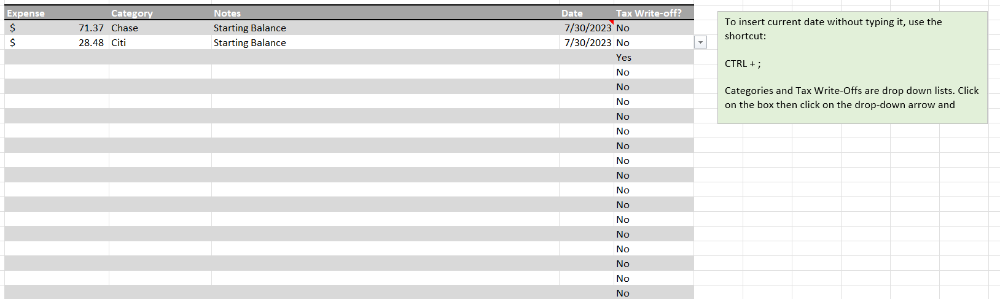

# HoK_Excel

This showcases my Excel projects. To open the projects, go to the projects folder inside of this repository, download the Excel project, and open it in Microsoft Excel.

# Personal Project, Data Tracking & Dashboard: Financial Tracking Tool  

This was a personal project I took on from a family member. He had been manually tracking his financials and wanted to be able to see his weekly and monthly summaries 
while at the same time tracking and inputting his income and expenses.

The categories for income and expenses were given to me by the family member, so that is what is displayed and those are the options.

I will break the project down step-by-step.

I started with a data validation sheet. This is a sheet that just has the income categories and expense categories. The sheet is very basic because I will hide this to not be messed with. It is shown below:

I knew there had to be separate sheets to track income and to track expenses so that is where I started.

Starting with the income sheet, I knew there needed to be columns for the date, amount, category, and notes to describe the purchase. I started by making the categories into a drop-down list using Excel's data validation feature and highlighting the income categories on the data validation tab. Since I knew the dashboard was going to have a monthly and yearly summary, I used formulas to automatically read them based on the date input. The formula read =IF(NOT(\[@Date\]=""),TEXT(\[@Date\],"YYYY"),""). To break this down, the formula reads if the date column is not blank, read in the year from the date column, otherwise keep the cell blank. I then copied the formula down and created the same formula in another column using "mm" instead of "YYYY" to read in the month. I hide the columns so my family member does not mess with the formulas, and then I input the values the family member gave me to start to get the following sheet:

Moving on to the Expense sheet, I duplicated the income sheet, changed the income column into the expense column, and filled in the expenses. I added data validation to make a drop-down list for the categories, and I added a column for the user to indicate if the expense is a tax write-off using a data validation list for the user to choose yes or no but is set to no by default. The page is displayed below:

Working off of the expenses sheet, I added a tax write-off sheet to the workbook. This sheet uses a pivot table on the entirety of the expense sheet, filters on the year, and where the tax write-off column is set to yes. With those qualifications, the pivot tables display the notes and sum of the expenses. I have added a button with a macro attached to refresh the pivot table for the family member because he is not too familiar with Excel. The sheet is shown below:

Moving on to the dashboard, I begin by making the first column the month with data validation of all 12 months in a drop-down list. I did a similar thing with the next column with a few years in the list. I move on to making the saving goals by adding a header in a column. I add the family member's savings goals and perform a sumifs formula to pull data that is in the selected year at the top of the sheet where the categories match the listed saving goals. I added conditional formatting to visualize the goals with the goal value set to what I was told the goals were by the family member. 

Moving to the monthly summary, I summarize the monthly income and expenses using a sumifs formula to filter only on income and expenses that are in the selected month and year at the top of the page. I then move below that summary and itemize the income and expenses based on the categories and add a filter to match the categories in the sumifs formulas.

On to the yearly tracking, I use a sumifs formula to filter for each month matching the listed month on the top of the current table matching the year at the top of the sheet. I use $ to keep the columns the same for the months selected and to keep the rows the same on the selected categories and copy the formula to the whole table for convenience. I did the same to the expense table. I added a pie chart to visualize expenses, and a stacked line chart to show expense habits monthly throughout the year. The result is shown below:

